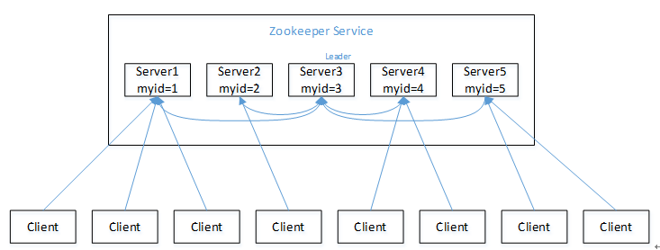
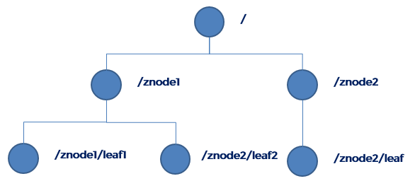
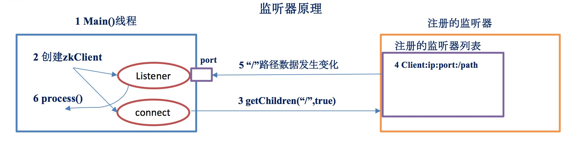
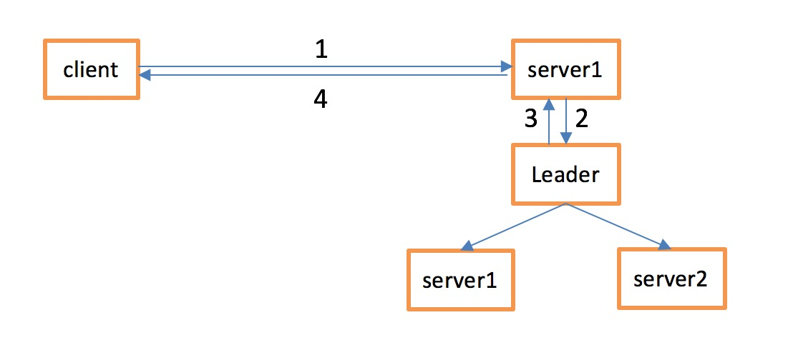

## 概述

### ZK是啥？

Zookeeper是一个开源的分布式的，为分布式应用提供协调服务的Apache项目。Zookeeper从设计模式角度来理解：
是一个基于观察者模式设计的分布式服务管理框架，它负责存储和管理大家都关心的数据，然后接受观察者的注册，一
旦这些数据的状态发生变化，Zookeeper就将负责通知已经在Zookeeper上注册的那些观察者做出相应的反应，从而
实现集群中类似Master/Slave管理模式。`Zookeeper=文件系统+通知机制`。

### ZK特点



* 1）Zookeeper：一个领导者（leader），多个跟随者（follower）组成的集群；
* 2）Leader负责进行投票的发起和决议，更新系统状态；
* 3）Follower用于接收客户请求并向客户端返回结果，在选举Leader过程中参与投票；
* 4）集群中只要有半数以上节点存活，Zookeeper集群就能正常服务（部署节点一般为奇数台）；
* 5）全局数据一致：每个server保存一份相同的数据副本，client无论连接到哪个server，数据都是一致的；
* 6）更新请求顺序进行，来自同一个client的更新请求按其发送顺序依次执行；
* 7）数据更新原子性，一次数据更新要么成功，要么失败；
* 8）实时性，在一定时间范围内，client能读到最新数据；

### ZK的数据结构



ZooKeeper数据模型的结构与Unix文件系统很类似，整体上可以看作是一棵树，每个节点称做一个ZNode。
每一个ZNode默认能够存储1MB的数据，每个ZNode都可以通过其路径唯一标识。

stat结构体：
* 1）czxid - 引起这个znode创建的zxid，创建节点的事务的zxid
* 2）ctime - znode被创建的毫秒数(从1970年开始)
* 3）mzxid - znode最后更新的zxid
* 4）mtime - znode最后修改的毫秒数(从1970年开始)
* 5）pZxid-znode最后更新的子节点zxid
* 6）cversion - znode子节点变化号，znode子节点修改次数
* 7）dataversion - znode数据变化号
* 8）aclVersion - znode访问控制列表的变化号
* 9）ephemeralOwner- 如果是临时节点，这个是znode拥有者的session id。如果不是临时节点则是0
* 10）dataLength- znode的数据长度
* 11）numChildren - znode子节点数量

### ZK节点的类型

两种类型：
* `短暂(ephemeral)`:客户端和服务器端断开连接后，创建的节点自己删除 
* `持久(persistent)`:客户端和服务器端断开连接后，创建的节点不删除

四种形式：
* 持久化目录节点(PERSISTENT) 
  客户端与 zookeeper 断开连接后，该节点依旧存在。 (2)持久化顺序编号目录节点(PERSISTENT_SEQUENTIAL)
* 持久化顺序编号目录节点(PERSISTENT_SEQUENTIAL)
  客户端与 zookeeper 断开连接后，该节点依旧存在，只是 Zookeeper 给该节点名称 进行顺序编号。
* 临时目录节点(EPHEMERAL)
  客户端与 zookeeper 断开连接后，该节点被删除。
* 临时顺序编号目录节点(EPHEMERAL_SEQUENTIAL)
  客户端与 zookeeper 断开连接后，该节点被删除，只是 Zookeeper 给该节点名称进行顺序编号。

关于有序节点：
* 创建 znode 时设置顺序标识，znode 名称后会附加一个值，顺序号是一个单调递增的计数 器，由父节点维护
* 在分布式系统中，顺序号可以被用于为所有的事件进行全局排序，这样客户端可以通过 顺序号推断事件的顺序

### ZK的应用场景

提供的服务包括：
* `统一命名服务`（通过znode的目录存储统一命名数据）
* `统一配置管理`（将配置信息配置到zk某个目录下，监听者监听配置信息是否发生变化，若发生变化则立刻同步）
* `统一集群管理`（将集群中每个节点的状态写到某个znode，监听者进行监听，若集群节点状态发生变化则立刻同步）
* `服务器节点动态上下线`（将集群中每个节点标识写到某个临时znode，监听这些临时节点，若下线则立刻更新服务器列表）
* `软负载均衡`（存储每个每个服务节点的访问数，进行软负载均衡）
* `分布式锁`（获取xxx/locknode下的`有序节点`列表，判断自己创建的节点是否是序号最小的，是则获取锁，否则监听比
   自己小一号的节点）


## ZKLeader的选举机制

Zookeeper默认的算法是FastLeaderElection，采用投票数大于半数则胜出的逻辑。

### 选举依据

* 服务器ID: 比如有3台服务器， 编号分别为 1、2、3，编号越大，在选举算法中的权重越大。
* 选举状态: 
    * LOOKING，竞选状态。
    * FOLLOWING，随从状态。同步leader状态，参与投票。
    * OBSERVING，观察状态，同步leader状态，不参与任何投票。
    * LEADING，领导者状态。
* 数据ID: 服务器中存放的最新数据的version，值越大说明数据版本越新，在选举算法中的权重越大。
* 逻辑时钟: 也可以叫投票的次数，同一轮投票过程中的逻辑时钟是相同的，每投完一次票这个数值都会增加，然后与接收到的
  其他服务器返回的投票信息中的数值相比，根据值不同做出不同的判断。

### 集群选举类型

`全新集群选举`与`非全新集群选举`。
**全新集群选举**：假设现在有5台服务器均没有数据，它们的编号分别是1，2，3，4，5，按编号依次启动。过程如下：
1. 服务器 1 启动，给自己投票，然后发投票信息给其他服务器，由于其他服务器没有启动，所以它收不到反馈信息，
   但是由于投票还没有到达半数（服务器1怎么知道一共有多少台服务器参与选举呢，那是因为在zk配置文件中配置
   了集群信息，所有配置了3888端口的服务器均会参与投票，假设这5台都参与投票，则超过半数应为至少3台
   服务器参与投票），所以服务器 1 的状态一直处于 LOOKING。
2. 服务器 2 启动，给自己投票，然后与其他服务投票信息交换结果，由于服务器 2 的编号大于服务器 1，所以服
   务器2胜出，但是由于投票仍未到达半数，所以服务器 2 同样处于 LOOKING 状态。
3. 服务器 3 启动，给自己投票，然后与其他服务投票信息交换结果，由于服务器 3 的编号大于服务器 2，1，所以
   服务器3胜出， 并且此时投票数正好大于半数， 所以选举结束，服务器 3 处于LEADING 状态，服务器1，服务
   器 2 处于 FOLLOWING 状态。
4. 服务器 4 启动， 给自己投票， 同时与之前的服务器 1、2、3交换信息，尽管服务器 4 的编号最大，但之前
   服务器 3 已经胜出，所以服务器4只能处于 FOLLOWING 状态。
5. 服务器 5 启动，同上。FOLLOWING状态。

**非全新集群选举**：对于运行正常的zookeeper集群，中途有机器down掉，需要重新选举时，选举过程就需要加入数据ID、
服务器ID、和逻辑时钟。
1. 逻辑时钟小的选举结果被忽略，重新投票；（除去选举次数不完整的服务器）
2. 统一逻辑时钟后，数据id大的胜出；（选出数据最新的服务器）
3. 数据id相同的情况下，服务器id大的胜出。（数据相同的情况下， 选择服务器id最大，即权重最大的服务器）


## ZK的安装配置和常用命令

zoo.conf

``` bash
tickTime=2000
initLimit=10
syncLimit=5
dataDir=/var/lib/zookeeper
dataLogDir=/var/log/zookeeper
clientPort=2181
#maxClientCnxns=60
#autopurge.snapRetainCount=3
#autopurge.purgeInterval=1
server.1=host01:2888:3888
server.2=host02:2888:3888
server.3=host03:2888:3888
```

### 常用客户端命令

``` bash
# 开启客户端控制台
$ zkCli.sh
$ zkCli.sh -server 172.16.127.129:2181
$ zkCli.sh -timeout 5000 -r -server 172.16.127.129:2181 #单位ms，-r只读

# 显示所有命令
[zk: localhost:2181(CONNECTED) 0] help 
ZooKeeper -server host:port cmd args
        stat path [watch]
        set path data [version]
        ls path [watch]
        delquota [-n|-b] path
        ls2 path [watch]
        setAcl path acl
        setquota -n|-b val path
        history 
        redo cmdno
        printwatches on|off
        delete path [version]
        sync path
        listquota path
        rmr path
        get path [watch]
        create [-s] [-e] path data acl
        addauth scheme auth
        quit 
        getAcl path
        close 
        connect host:port
        
# 举例说明
ls /
ls2 /

#创建节点
#create [-s] [-e] path data acl
#-s：表示当前创建的节点是一个顺序节点
#-e：表示当前创建的节点是一个临时节点，临时节点下面不能再创建子节点，并且当前会话消失后该临时节点被删除
#-s和-e两个参数可以同时使用
create /banzhang ""
get /banzhang

create -e /banzhang2 "hehe" (会话关闭，节点被删除)
get /banzhang2

create -s /banzhang3 1
create -s /banzhang3 2
ls /
[zookeeper, banzhang30000000014, banzhang30000000015]

set /banzhang "xiaojuan"
get /banzhang

get /banzhang watch （监听本节点值的变化和自身删除事件（watcher使用一次后需再次注册才有效），注意不包括子节点的任何变化）
set /banzhang 2
WATCHER::
WatchedEvent state:SyncConnected type:NodeDataChanged path:/banzhang

ls /banzhang watch（监听本路径下子节点的创建和删除（一次有效），注意不包含子节点值的变化和孙子节点的任何变化）
create /banzhang/id 1
WATCHER::
WatchedEvent state:SyncConnected type:NodeChildrenChanged path:/banzhang

delete /banzhang/id （该节点没有子节点的情况下才能被删除）
ls /banzhang

rmr /banzhang （递归删除）
ls /
stat /
```

## ZK权限管理（ACL）

​传统的文件系统中，ACL分为两个维度，一个是属组，一个是权限，子目录/文件默认继承父目录的ACL。而在Zookeeper中，
node的ACL是没有继承关系的，是独立控制的。Zookeeper的ACL，可以从三个维度来理解：一是scheme; 二是user; 三
是permission，通常表示为 scheme : id : permissions, 下面从这三个方面分别来介绍：

* scheme：zk3 缺省支持下面几种scheme：
    * ip：它对应的id为客户机的IP地址，设置的时候可以设置一个ip段，比如ip:192.168.1.0/16, 表示匹配前16个bit的IP段
    * digest：它对应的id为username:BASE64(SHA1(password))，它需要先通过username:password形式的authentication
    * auth：它不需要id, 只要是通过authentication的user都有权限（zookeeper支持通过kerberos来进行authencation, 也
      支持username/password形式的authentication)
    * super：在这种scheme情况下，对应的id拥有超级权限，可以做任何事情(crwda)
    * world：它下面只有一个id, 叫anyone, world:anyone代表任何人，zookeeper中对所有人有权限的结点就是属于world:anyone的
    * sasl：zk3还提供了对sasl的支持，不过缺省是没有开启的，需要配置才能启用。sasl的对应的id，是一个通过sasl authentication
      用户的id，zk3中的sasl authentication是通过kerberos来实现的，也就是说用户只有通过了kerberos认证，才能访问它有权限的node.
* id：id与scheme是紧密相关的，具体的情况在上面介绍scheme的过程都已介绍，这里不再赘述。
* permission：zookeeper目前支持下面一些权限
    * CREATE(c): 创建权限，可以在在当前node下创建child node
    * READ(r): 读权限，可以获取当前node的数据，可以list当前node所有的child nodes
    * WRITE(w): 写权限，可以向当前node写数据
    * DELETE(d): 删除权限，可以删除当前的node
    * ADMIN(a): 管理权限，可以设置当前node的permission    

``` bash
#创建数据节点时设置acl
#create [-s] [-e] path data acl
> create /znode02 456 ip:172.16.127.131:crw
Created /znode02

> create /znode03 0 digest:tom:Aasasla+azxasU=:crwda #user:BASE64(SHA1(password))
Created /znode03

#获取当前节点的acl信息
> getAcl /znode02
'ip,'172.16.127.131
: crw

#设置节点的acl
#setAcl path acl
> setAcl /znode03 ip:172.16.127.131:crwd
cZxid = 0x4140000008f
...
aclVersion = 1	#aclVersion递增1
...
numChildren = 0

#添加认证以对节点数据进行访问
#addauth scheme auth
> addauth digest tom:123456

#当设置了znode权限，但是密码忘记了怎么办？还好Zookeeper提供了超级管理员机制
#修改zkServer.sh，加入super权限设置(只对当前zk集群节点)
> vim zkServer.sh
-----------------------------------------------
98 _ZOO_DAEMON_OUT="$ZOO_LOG_DIR/zookeeper.out"
99 SUPER_ACL="-Dzookeeper.DigestAuthenticationProvider.superDigest=super:gG7s8t3oDEtIqF6DM9LlI/R+9Ss="
100 
101 
102 case $1 in
...
111     nohup "$JAVA" "-Dzookeeper.log.dir=${ZOO_LOG_DIR}" "-Dzookeeper.root.logger=${ZOO_LOG4J_PROP}" "$SUPER_ACL"\
112     -cp "$CLASSPATH" $JVMFLAGS $ZOOMAIN "$ZOOCFG" > "$_ZOO_DAEMON_OUT" 2>&1 < /dev/null &
113     if [ $? -eq 0 ]
...
-----------------------------------------------

#重新启动Zookeeper，这时候使用 addauth digest super:super 进行认证
> ./zkServer.sh restart
> ./zkCli.sh

> get /znode02
Authentication is not valid : /znode02

> addauth digest super:super
> get /znode02
456
cZxid = 0x4140000008c
...
numChildren = 0

> delete /znode02
``` 
 
## ZK的监听原理



监听的原理：

* 1）首先要有一个main()线程
* 2）在main线程中创建Zookeeper客户端，这时就会创建两个线程，一个负责网络连接通信（connet），一个负责监听（listener）。
* 3）通过connect线程将注册的监听事件发送给Zookeeper。
* 4）在Zookeeper的注册监听器列表中将注册的监听事件添加到列表中。
* 5）Zookeeper监听到有数据或路径变化，就会将这个消息发送给listener线程。
* 6）listener线程内部调用了process()方法。

常见的监听：

*（1）监听节点数据的变化：get path [watch]
*（2）监听子节点增减的变化：ls path [watch]


## ZK写数据的流程



* 1）Client 向 ZooKeeper 的 Server1 上写数据，发送一个写请求。
* 2）如果Server1不是Leader，那么Server1 会把接受到的请求进一步转发给Leader，因为每个ZooKeeper的Server里面有一个是Leader。
   这个Leader 会将写请求广播给各个Server，比如Server1和Server2，各个Server写成功后就会通知Leader。
* 3）当Leader收到大多数 Server 数据写成功了，那么就说明数据写成功了。如果这里三个节点的话，只要有两个节点数据写成功了，那么就认
   为数据写成功了。写成功之后，Leader会告诉Server1数据写成功了。
* 4）Server1会进一步通知 Client 数据写成功了，这时就认为整个写操作成功。ZooKeeper 整个写数据流程就是这样的。


## 代码示例

参考：[https://github.com/kinglyjn/zdemo-zookeeper](https://github.com/kinglyjn/zdemo-zookeeper)


